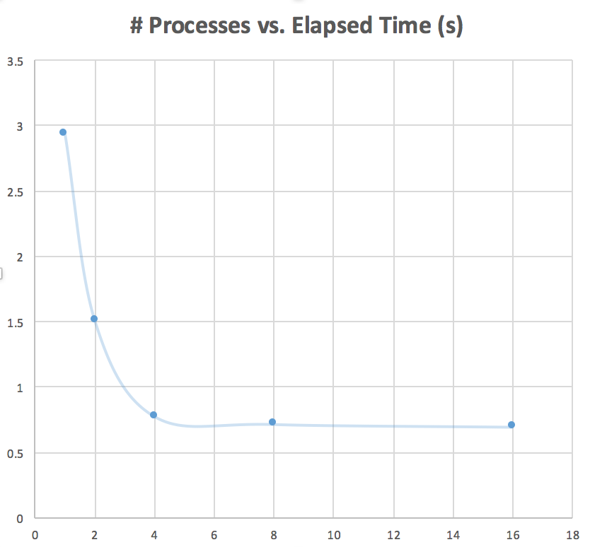
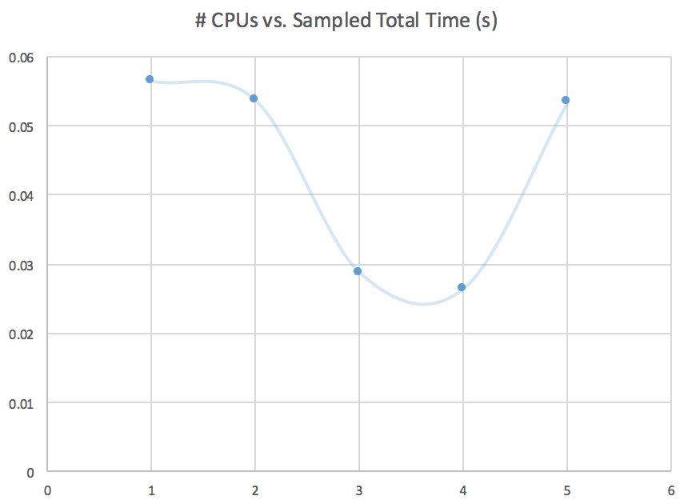

Hun Jae Lee (hxl224)
EECS338 Homework 8
Due 161109 Wed

---

## How to run

- `make` to compile all files
- `make q1` to run forking sum program.
  - If you are on HPC, run `sbatch q1.slurm`
- `make q2` to run Shubert OMP timer program.
  - If you are on HPC, run `sbatch q2.slurm`
- `make clean` to clean up the output files


## Program Outputs & Discussion


### Q1. Forking sum

In the following output, the following procedure was repeated for 5 times for using 1, 2, 4, 8, 16 processes:

```
$ vi q1.c				# change the NUM_PROCS value in q1.c
$ sbatch q1.slurm
Submitted batch job 2374789
$ cat q1.output 
5 cores available.
1 processes, sampled total time: 2.939381 seconds.
```

Omitting the commands, each run's output is collected as follows:

| Number of Processes | Sampled Total Time (s) |
| :-----------------: | :--------------------: |
|          1          |        2.939381        |
|          2          |        1.511539        |
|          4          |        0.778291        |
|          8          |        0.717784        |
|         16          |        0.697044        |

Which then can be graphed as following:



I was able to see a significant decrease in total time for increased number of processes.

### Q2. Shubert OMP timer

```
$ vi q2.slurm				# change the cpus-per-task value in q2.slurm
$ sbatch q2.slurm
Submitted batch job 2374906
$ cat q2.output
5 cores available
5 threads.
Total time was 0.053814 seconds.
min = -186.669291
```

Omitting the commands, each run's output is collected as follows:

| Number of CPUs | Sampled Total Time (s) |
| -------------- | ---------------------- |
| 1              | 0.056519               |
| 2              | 0.053684               |
| 3              | 0.028713               |
| 4              | 0.026464               |
| 5              | 0.053492               |

Which then can be graphed as following:



I was able to see a significant decrease in total time for increased number of CPUs; however, for 5 CPUs the total time increased, while hypothetically it was supposed to have less time elapsed than lower number of CPUs.

## Notes

- File naming convention:
   1. `q1.c`, `q2.c`: source code, each number corresponding to the question number in the assignment.
   2. `q1.slurm`, `q2.slurm`: the slurm batch files, each number corresponding to the question number in the assignment.
   3. `makefile`: the makefile, used to test running locally.
   4. `README.md`: what you are reading right now
   5. `/src/`: Original files given with the assignment and graph image files
- The number of cores is set in the slurm batch script.
